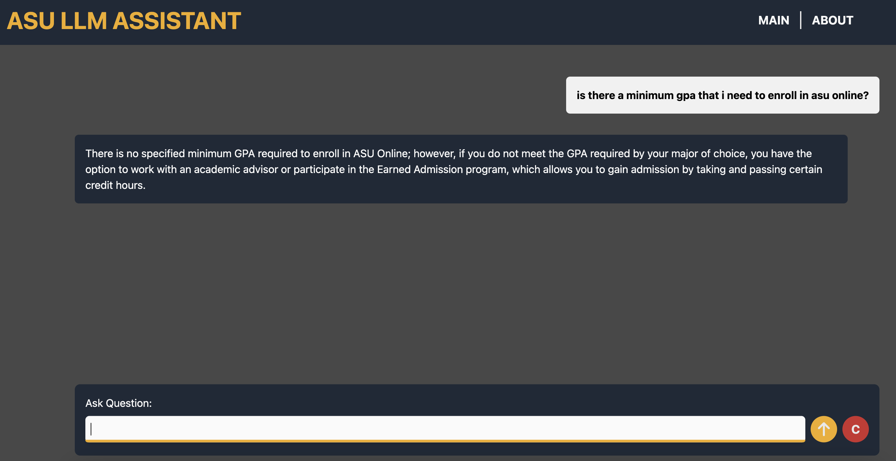
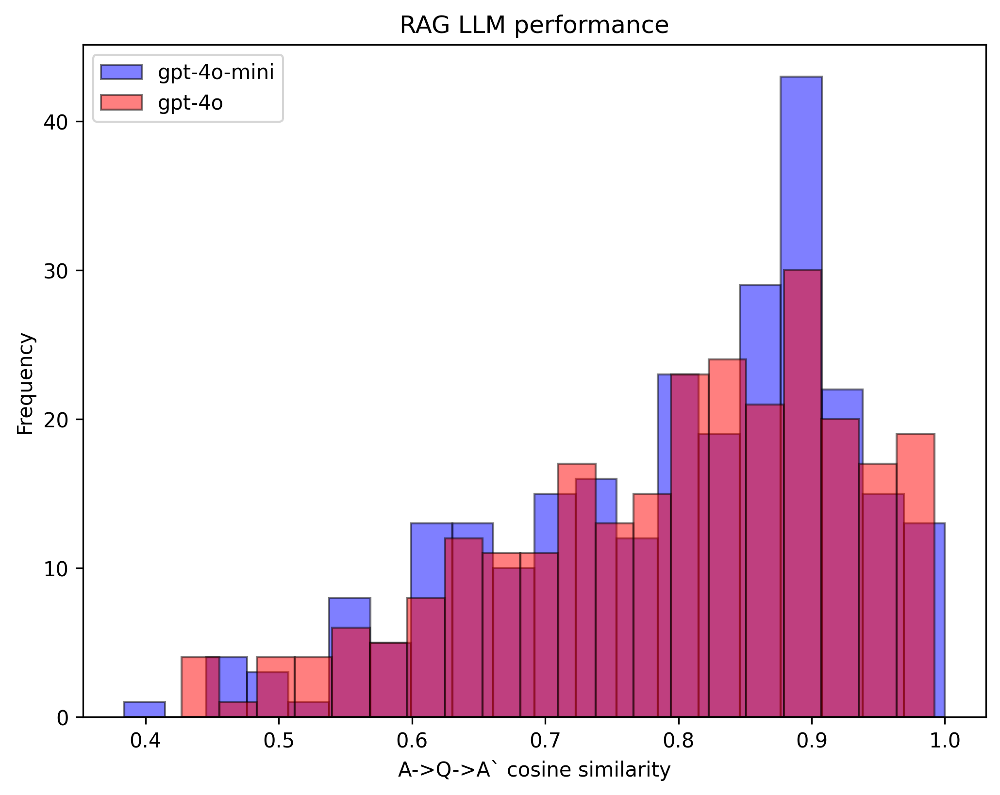

# ASU Online assistant


## Problem Statement
ASU Online provides a comprehensive set of FAQs, but users often struggle to find the most relevant answers quickly. Searching through static FAQ pages can be inefficient, leading to frustration and delays in accessing important information.

### Proposed Solution
This project implements a **Retrieval-Augmented Generation (RAG)** system to enhance the user experience by allowing users to query ASU Online’s FAQs and receive accurate, concise responses. The system uses a search engine to index the FAQs, retrieves the top 10 relevant results, and then generates a response using a lightweight LLM (gpt-4o-mini and similar).

The RAG system has been deployed via and [api](#back-end) and has a [website](#front-end) as the user interface.

> The main website can be found here:
>
> **[https://llm-asu-assistant.vercel.app/](https://llm-asu-assistant.vercel.app/)**
> 
>

### Dataset
The dataset used for this ASU online assistant comes from the [FAQ website](https://asuonline.asu.edu/about-us/faq). The data was scrubbed and cleaned using the jupyter file [00_cleaning_json.ipynb](notebooks/00_cleaning_json.ipynb), and it resulted in 265 unique entries.

## How to run the project

### Prerequisites
- Python 3.x
- A virtual environment (`.venv`) with necessary libraries installed
- OpenAI API key stored in a `.envrc` file

### Technologies
- [minsearch](https://github.com/alexeygrigorev/minsearch) - for full-text search
- openAI - as an LLM
- Flask - as the API interface
- render - platform used to deploy the api for the back-end
- vercel - platform used to deploy the website for the front-end

### Setup instructions
1. Clone the repository:
    ```bash
    git clone https://github.com/anicolas91/LLM_ASU_assistant.git
    cd LLM_ASU_assistant
    ```
2. Create the virtual environment
    ```bash
    python -m venv .venv
    ```
3. Activate the virtual environment
    ```bash
    source .venv/bin/activate  # On macOS/Linux
    .\.venv\Scripts\activate  # On Windows
    ```
4. Install the required dependencies: Ensure all necessary libraries are installed:
    ```bash
    pip install -r requirements.txt
    ```
5. Set your OpenAI API key: The OpenAI API key is saved in a .envrc file. Make sure it contains:
    ```bash
    OPENAI_API_KEY=your-openai-api-key-here
    ```


### Running it
1. To run the application, simply call:
   ```bash
   gunicorn --bind=0.0.0.0:9696 api.app:app
   ```

2. Then you can test the app via CURL:
   ```bash
    URL=http://localhost:9696
    QUESTION="what do I need to enroll to online graduate classes?"
    DATA='{
        "question": "'${QUESTION}'"
    }'

    curl -X POST \
        -H "Content-Type: application/json" \
        -d "${DATA}" \
        ${URL}/question
   ```

   You should see an answer that looks like this:
   ```bash
    {
        "answer": "To enroll in online graduate classes, you need to apply to a graduate program at ASU Online, which you can do while in your final year of your undergraduate degree. The application will require your junior-senior GPA and you can submit unofficial transcripts initially. If accepted, you will later need to provide official transcripts. Ensure that you apply at least a month or two in advance of your chosen start date. Once admitted, you can log in to My ASU using your ASURITE ID and password to find and enroll in classes.",
        "conversation_id": "39002024-8fbb-4698-a2aa-c88dc80fbcd8",
        "question": "what do I need to enroll to online graduate classes?"
    }
   ```

3. You can also send feedback via:
    ```bash
    ID="39002024-8fbb-4698-a2aa-c88dc80fbcd8"

    FEEDBACK_DATA='{
    "conversation_id": "'${ID}'",
    "feedback": 1
    }'

    curl -X POST \
        -H "Content-Type: application/json" \
        -d "${FEEDBACK_DATA}" \
        ${URL}/feedback
    ```

    Which should result in an answer that looks like this:
    ```bash
    {
        "message": "Feedback received for conversation 39002024-8fbb-4698-a2aa-c88dc80fbcd8: 1"    
    }
    ```

> NOTE: The feedback is still WIP and the initial bits are on the api, however we still have to add the request from the user in the front-end version and we have yet to set up the db for storage and monitoring.

### Misc
To view/debug the whole pipeline for experimentation, basically run the main jupyter file:
```bash
jupyter notebook notebooks/01_rag_flow.ipynb
```

## Code

The code for the application is inside the [api](/api/) folder.

It contains the following documents:
- [app.py](api/app.py) - the Flask API, the main entrypoint to the application
- [ingest.py](api/ingest.py) - loading the data into the knowledge base
- [rag.py](api/rag.py) - the main RAG logic for building the retrieving the data and building the prompt
- [minsearch.py](api/minsearch.py) - an in-memory search engine


## Interface

### Back-end
We are using Flask for serving the application as an API.

This API can then be called to retrieve a RAG answer given a question fed through front end.

Right now the API has been deployed with render at [https://llm-asu-assistant.onrender.com](https://llm-asu-assistant.onrender.com)

### Front-end
The ASU assistant front end is now a website deployed live using vercel at [http://llm-asu-assistant.vercel.app](http://llm-asu-assistant.vercel.app).

The repository is [llm-asu-assistant-frontend](https://github.com/anicolas91/llm-asu-assistant-frontend).

Kudos to [Sihun Kim](https://github.com/bobbykim89) for the development of the front end!.

## Ingestion

The ingestion script is in [ingest.py](api/ingest.py).

Since we use an in-memory database, minsearch, as our knowledge base, we run the ingestion script at the startup of the application.

The ingestion script is executed inside [rag.py](api/rag.py) when we import it.

## Evaluation
To have a look at the code that is evaluating the system, you can check the latter portion in [01_rag_flow.ipynb](notebooks/01_rag_flow.ipynb).

We are basically using the following for our RAG:
- knowledge base: in-house search engine 'minsearch' fitted to ASU online FAQs.
- LLM: openAI model such as gpt-4o-mini.

### Retrieval
For the basic approach, that is, not using any boosting when using minsearch, we get the following metrics:
- Hit rate: 0.74
- Mean Reciprocal Rank: 0.47

Using hyperopt, we optimize the boost values so that question gets boosted by 0.2 and section by 0.07, thus giving us the following metrics:
- Hit rate: 0.94
- Mean Reciprocal Rank: 0.77

#### Interesting notes about optimal boost values being <1.
We can notice that hyperopt has found a boost on the question to be ~0.2, which is a tad counterintuitive as one would figure the actual question would be of significant importance to get a good response in our search engine.

Turns out, there are multiple reasons for the question boost value to be <1:
- balance between fields: a high boost value on question may overshadow any contributions from the section component, so you may need lower the boost value for questions to even things out with the section field.
- field quality: the question actually may be a bit too generic or ambiguous and the section field may provide additional context.
- field overfitting: a high boost value on the question may make the search engine to prioritize exact matches, so to help the engine find relevant results that are not quite exact, you may need to reduce the boost.
- search engine sensitivity: maybe the minsearch engine is too sensitive to boost values and it may miss subtle but relevant matches if the value is too high.


### RAG flow
We used the cosine similarity metric to evaluate the performance of our RAG flow given different openAI models.

We evaluated 256 ground truths using both gpt-4o-mini and gpt-4o.

The results were as follows:



We see that the performance is relatively equivalent, with gpt-4o performing slightly better.

In the interest of economy we will proceed with gpt-4o mini, since that one is ~10x cheaper than gpt-4o.

## Monitoring
This is future work and is WIP. The main idea is to do the following:
1. Get thumbs up/thumbs down from the user.
2. Convert those thumbs up/thumbs down to a binary response 1 or -1.
3. Send it to a database via the api's 'feedback' method.
4. Monitor the feedback alongisde the question/answer given by the LLM.

